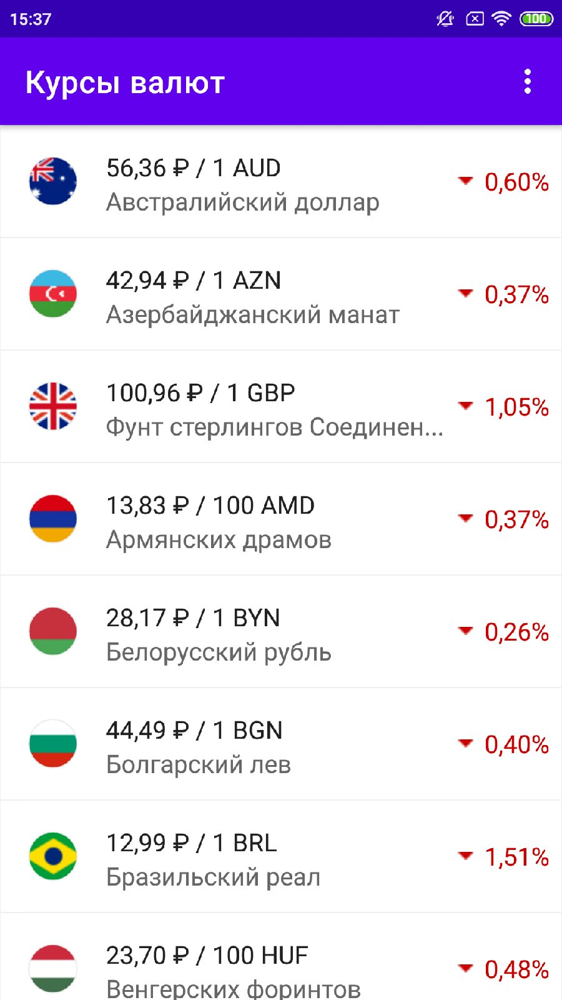
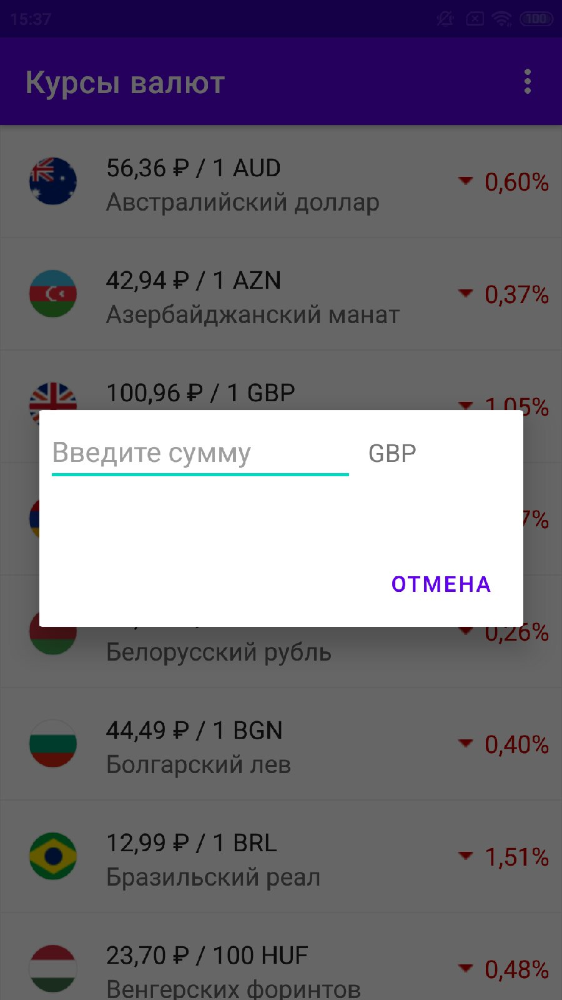

### Данный проект содержит исходный код приложения для вывода ежедневных курсов валют и конвертации рублевой суммы в любую доступную валюту.

[Требования к приложению](https://drive.google.com/file/d/122MrDCIUBKL6DkZHnSjbYOYP_6_Oy84K/view)

Скриншоты:

 

### Характеристики приложения:
Приложение написано на языке Java 1.8 для платформы Android версии API не ниже 21 (Android 5.0).

### Библиотеки

| Назначение       | Название            | Мотивация |
| -------------  |:------------------:| -----:|
| Работа с сетью     | Retrofit    | Наиболее полная документация и хорошие примеры использования |
| Сериализация/десериализация объектов | Gson | Де факто стандартный сериализатор для Retrofit |
| Вывод изображений с наложенной круглой маской| CircleImageView|Наиболее популярная и поддерживаемая библиотека из используемых для этих целей|
| Обновление данных при помощи жестов | SwipeRefreshLayout | Стандартная библиотека Android |
| Сохранение данных при изменении конфигурации | Android Components | MVVM, стандартная библиотека Android |

### Работа с приложением:

Приложение получает актуальный список обменных курсов при запуске. Ручное обновление курсов доступно через меню либо стандартным жестом Pull-To-Refresh на списке валют. При тапе на выбранную валюту открывается диалоговое окно в котором можно ввести сумму в рублях которую необходимо конвертировать.

